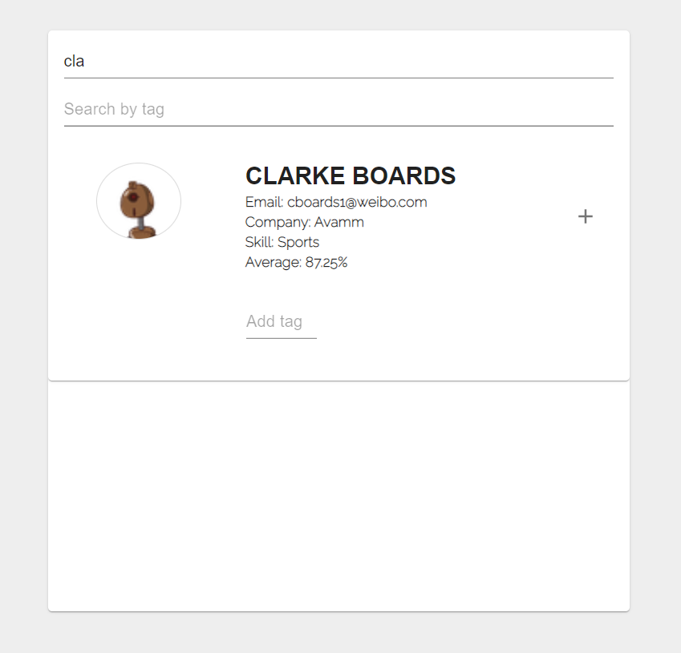
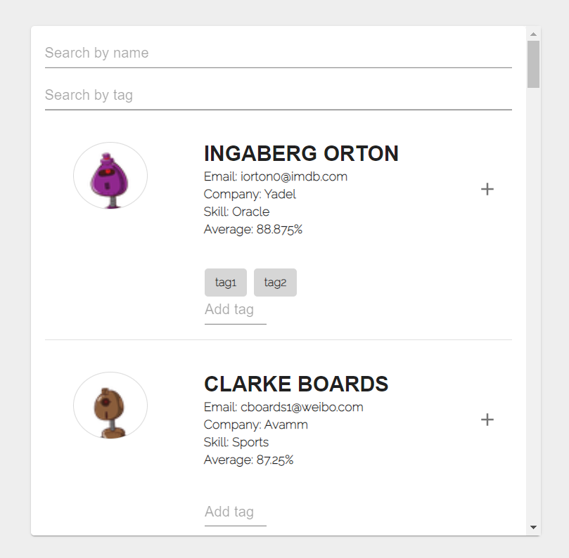
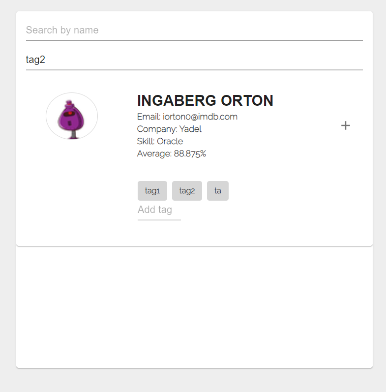

# React filter app example
This is example showcase for react filter app. This filter app will fetch api from https://api.hatchways.io/assessment/students

This app was built with using React, Material-Ui and Axios

### Layout

### filter by name

### add tags to each item

### filter by tag

## Available Scripts
In the project directory, you can run:

### `npm start`

Runs the app in the development mode.\
Open [http://localhost:3000](http://localhost:3000) to view it in your browser.

